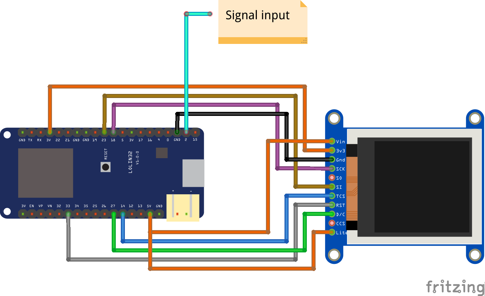

# VerySimpleArduinoDigitalOscilloscope

## This is a didactic code
To learn the basic operation of a DSO build with a electronic hobbyist common components.

Whit this small code write in arduino you can run quickly a very simple oscilloscope, that can draw signal up to 50KHz

## Atencion: The ESP32 processor only support 3.3v maximum in the analog imputs, if you need measure signals with higher voltages please implement a voltage divisor before.

Examples

## ESP32 y ST7735

## M5Stack

## Basic wiring

Thanks
