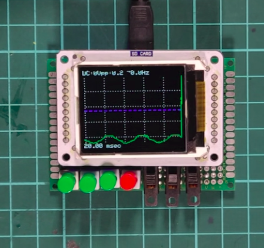
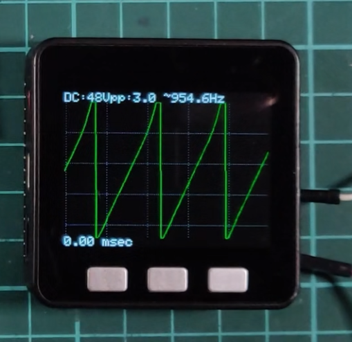

# VerySimpleArduinoDigitalOscilloscope

## This is a didactic code
To learn the basic operation of a DSO build with a electronic hobbyist common components.

Whit this small code you can run quickly a very simple oscilloscompe that can draw signal up to 50KHz

Ejemplos

## ESP32 y ST7735

## M5Stack

Thanks
